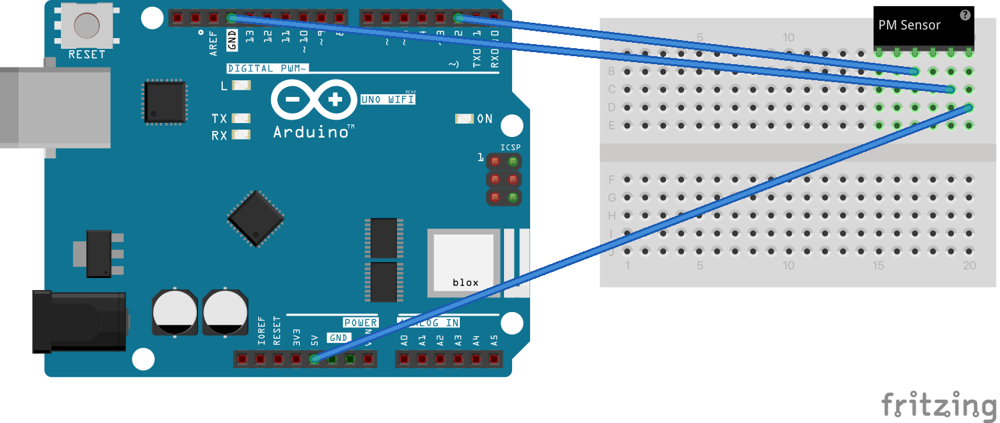

Note: this prototype is an optional first step prior to redevelopment using an ESP32.

Start by emplacing the components on a breadboard: 

Prior to uploading the Arduino code, it is recommended that you randomise the Bluetooth Service and Characteristic keys, as these should be unique identifiers.