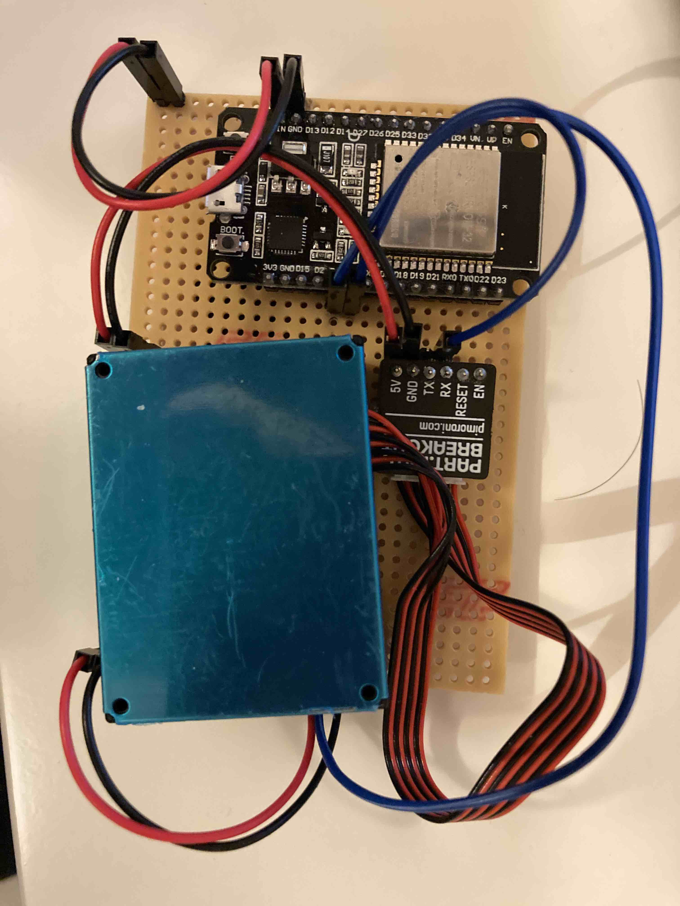
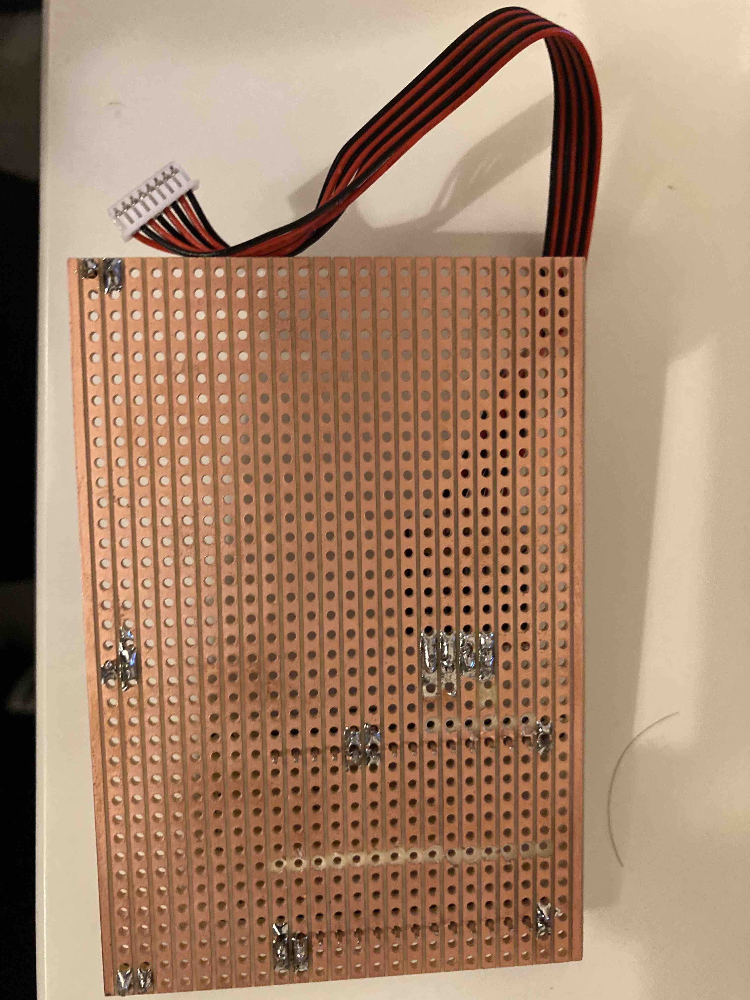
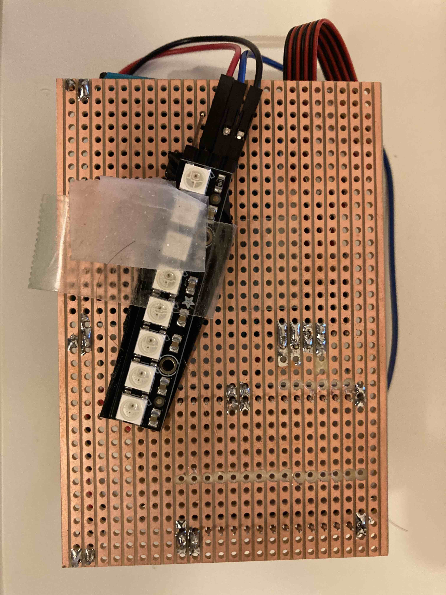

Follow the following steps:

1. As a NeoPixel is in use in this example, you will need to solder a set of four jumper pins onto its input end.
2. After the NeoPixel has been prepared, you can prototype this version on a breadboard:
   
3. Upload `pm25_neopixel_esp32.ino` to your ESP32 microcontroller.
4. Build the stripboard-based prototype:
   *  Solder 14 jumper pins onto the stripboard
   *  Solder the ESP32 onto the stripboard
   *  Solder the PM Breakout to the stripboard

   *  Create gaps in the board using a hand drill to prevent short circuiting

   *  Add all of the non-soldered components: connect the particulate matter breakout board to the PMS5003 sensor and wire both the header pins and the neopixel using female-female cables
   * Test again that the device works as it did on the breadboard. Plug in the ESP32 to a 5V power source (such as a computer's USB port) to test that the Neopixel is still lighting up similarly to how it did in the breadboard prototype.
   * Secure the PMS5003 by placing a roll of transparent tape underneath it and wedging it between different header pins.

   * Insulate the non-illuminating side of the neopixel using electrical tape.
   * Secure the NeoPixel (LEDs faced away) to the copper side of the stripboard using transparent tape
